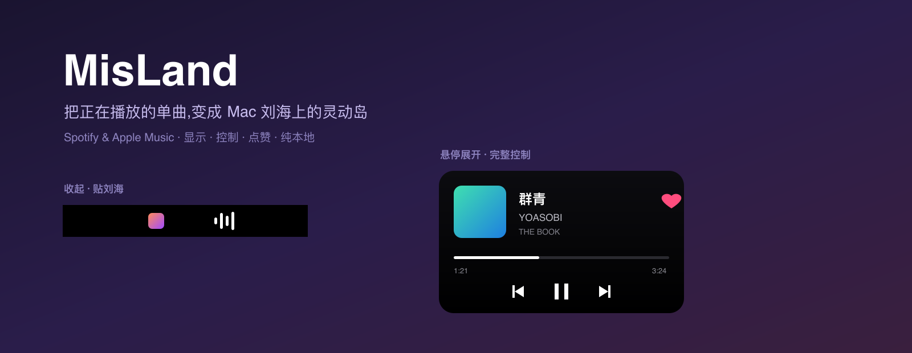

<div align="center">



# MisLand

**把正在播放的单曲,变成 Mac 刘海上的「灵动岛」。**
A native macOS Dynamic Island for the music you're playing.

[](https://github.com/shadycheer/misland/releases/latest)


</div>

---

MisLand 常驻在 MacBook 的刘海里(没有刘海的屏幕则悬浮在顶部正中)。平时是贴着刘海的一颗小药丸,鼠标移上去展开成完整播放器——封面、歌名、进度、控制、点赞,一应俱全。纯本地、低占用、不需要任何登录授权。

## ✨ 功能 Features

- **🎵 贴刘海的灵动岛** — 黑色药丸与刘海融为一体;hover 展开、移开收起;无刘海屏自动降级为顶部悬浮药丸。
- **🟢 Spotify + 🍎 Apple Music** — 谁在放就显示谁;两个同时放时,最近操作的胜出。
- **🪟 多屏跟随** — 岛跟着你正在用的那块屏走(点哪块屏的窗口,就去哪块屏)。
- **▶️ 播放控制** — 上一首 / 播放暂停 / 下一首,进度可拖动。
- **❤️ 点赞** — 加入/移出「喜欢的歌曲」。Apple Music 走本地脚本;Spotify 走其自带的 `spotify_cli`(无需 OAuth、不受 Web API 配额限制)。
- **🔗 点击跳转** — 点歌名 / 歌手 / 专辑直接打开 Spotify 对应页面。
- **🔀 独占播放** — 开一个自动停另一个,同一时间只放一个播放器(可在偏好设置关闭)。
- **👀 切歌探头** — 换歌时自动弹出 ~2 秒瞄一眼,然后收回。
- **🖼 分享卡片** — 一键把「正在播放」卡片(封面 + 信息 + 平台标 + 二维码)复制到剪贴板。
- **🪶 极轻** — 事件驱动 + 0.5s 进度心跳,播放器读取走后台线程;空闲 ~2% CPU、<50MB 内存。

## 📦 安装 Install

从 [Releases](https://github.com/shadycheer/misland/releases/latest) 下载 `misland.dmg`,打开后把 **MisLand** 拖进 Applications。

> 应用是 ad-hoc 签名(未公证),首次打开需手动放行:**右键 MisLand → 打开 → 打开**。首次操作播放控制时,macOS 会请求「自动化」权限来控制 Spotify / Music,点允许即可。

设置与退出:点菜单栏 🎵 图标,**或直接右键岛本身**(菜单栏挤满、图标被刘海吞掉时也能用)。

## 🛠 从源码构建 Build

```bash
make run      # 构建并启动
make watch    # 保存即重新构建+重启(开发循环)
make test     # 单元测试
make dmg      # 打包可分发的 .dmg
```

发版:打 tag 推上去即可由 GitHub Actions 自动构建 DMG 并发布到 Releases。

```bash
git tag v0.1.0 && git push origin v0.1.0
```

## ⚙️ 原理 How it works

macOS 并没有「灵动岛 API」——刘海只是一块惰性挖孔。MisLand 在刘海正下方画一个无边框、不抢焦点、永远置顶的 `NSPanel`;因为它是黑色圆角的,就和硬件刘海融为一体。一个全局鼠标监听切换点击穿透,所以这层浮层不会挡住下面的 app。

歌曲数据来自各播放器的本地 `ScriptingBridge` 接口(不走网络,也不依赖被 Apple 在 macOS 15.4+ 锁死的私有 `MediaRemote`)。Spotify 点赞与跳转用的是 Spotify 自带的 `spotify_cli`,它与已登录的桌面端通信。Apple Music 流媒体曲目拿不到本地封面时,用公开的 iTunes Search API 兜底取封面。

## 📝 说明 Notes

- 点击跳转目前仅 Spotify(Apple Music 本地不暴露艺人/专辑的公开链接)。
- 网易云音乐 / QQ 音乐在 macOS 15.4+ 无法支持:既无脚本接口、`MediaRemote` 又被锁、窗口也读不到可用的辅助功能树。

<div align="center">
<sub>Built with Swift + SwiftUI · 纯本地 · 无遥测</sub>
</div>
